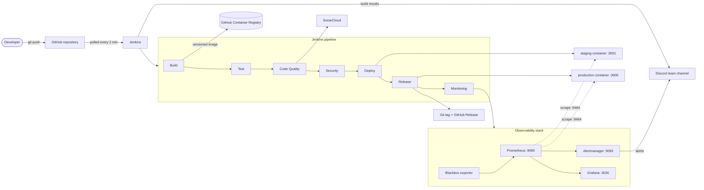

# SmishGuard

SmishGuard helps people check whether a text message is a scam before they tap a link. It scores a message from 0 to 100, explains every warning sign it found in plain language, and lets signed-in users report scams so the community can see what is circulating. It understands English and Vietnamese (typed with or without accents), because scam texts often target people whose first language is not English.

The project is delivered through a seven-stage Jenkins pipeline: **Build, Test, Code Quality, Security, Deploy, Release and Monitoring**. Every commit is built once, tested, analysed, scanned, deployed to staging, promoted to production and then verified by the monitoring stack, with automatic rollback if anything goes wrong.

> Deakin University, SIT223/SIT753 Professional Practice in IT, Task 7.3HD. Author: Tien Phat Thai.

## Contents

- [Features](#features)
- [Architecture](#architecture)
- [Technology](#technology)
- [The pipeline](#the-pipeline)
- [Run it locally](#run-it-locally)
- [Set up the pipeline in Jenkins](#set-up-the-pipeline-in-jenkins)
- [Monitoring and alerting](#monitoring-and-alerting)
- [Repository layout](#repository-layout)
- [Troubleshooting](#troubleshooting)

More detail: [pipeline design decisions](docs/PIPELINE.md), [security](docs/SECURITY.md), [alert runbook](docs/RUNBOOK.md).

## Features

| Area | What it does |
|---|---|
| Risk checking | Explainable, rule-based engine: link shorteners, raw IP links, look-alike domains of Australian brands and Vietnamese banks, links that hide their real destination behind an `@`, internationalised look-alike domains, urgency, requests for passwords or one-time codes, payment and gift-card requests, prize and refund lures, parcel-delivery lures |
| Languages | English and Vietnamese, with or without diacritics (`khẩn cấp` and `khan cap` both match) |
| Accounts | Registration and login with scrypt password hashing and short-lived JWTs (algorithm pinned to HS256) |
| Reports | Create, list (filter and paginate), read, update status and delete scam reports; admins can see every report |
| Statistics | Public, aggregate-only statistics by risk level, language and status |
| Web UI | Single page served by the API, with an environment and version badge so you can see which build is live |
| Operations | `/health` (liveness), `/ready` (database check), `/version` (build metadata), Prometheus metrics on a private port |

API summary:

| Method and path | Auth | Purpose |
|---|---|---|
| `POST /api/check` | none | Score a message (nothing is stored) |
| `POST /api/auth/register`, `POST /api/auth/login` | none | Create an account, get a token |
| `GET /api/auth/me` | token | Current user |
| `POST /api/reports`, `GET /api/reports` | token | Report a message, list your reports (`?level=high&limit=20&offset=0`) |
| `GET/PATCH/DELETE /api/reports/:id` | token | Read, update (`status`, `notes`) or delete a report |
| `GET /api/stats` | none | Aggregate statistics |
| `GET /health`, `/ready`, `/version` | none | Operational endpoints |
| `GET :9464/metrics` | internal | Prometheus metrics (not published outside the Docker network) |

## Architecture



Staging, production and the monitoring stack run as Docker Compose projects on one shared Docker network (`smishguard-observability`). Only the API ports are published to the host; metrics stay private to the network.

## Technology

| Concern | Choice |
|---|---|
| Application | Node.js 24, Express 5, built-in `node:sqlite` (no native build step), zod validation, helmet, express-rate-limit, pino structured logs, prom-client |
| Tests | Jest 30 + Supertest (unit and integration), post-deployment end-to-end suite, container smoke test, promtool unit tests for alert rules |
| Build artefact | Multi-stage Docker image (non-root, npm removed, health check, OCI labels) stored in GitHub Container Registry |
| Code quality | ESLint 10 with complexity and size thresholds, SonarCloud with quality gate, custom quality policy with trend reporting |
| Security | npm audit (SCA), Semgrep (SAST), Trivy (secrets, Dockerfile misconfiguration, image CVEs), CycloneDX SBOM, policy-as-code gate |
| Deployment | Docker Compose environments (infrastructure as code) with health verification and automatic rollback |
| Release | Registry promotion (`:production`), Git tag and GitHub Release with generated notes |
| Monitoring | Prometheus, Alertmanager, Blackbox exporter, Grafana; alerts to Discord |
| CI/CD | Jenkins declarative pipeline, cross-platform (Windows `bat` or Linux `sh`) |

## The pipeline

| # | Stage | What happens | Gate (the build stops if...) |
|---|---|---|---|
| 1 | Build | Clean workspace, record toolchain versions, `npm ci`, build the Docker image tagged `1.0.<build>` and `sha-<commit>`, push both to GHCR | the image does not build or cannot be stored |
| 2 | Test | In parallel: Jest unit and integration tests with coverage, and a smoke test of the built container (health, version, non-root user, no npm, size, labels). Results appear as JUnit reports and a coverage trend | any test fails or coverage drops below 90% lines / 80% branches |
| 3 | Code Quality | ESLint (complexity at most 10, zero warnings), SonarCloud analysis waiting for the quality gate, then a custom policy and metric trend from the SonarCloud API | ESLint finds anything, the SonarCloud gate fails, or the custom policy fails |
| 4 | Security | In parallel: npm audit, Semgrep, Trivy (repository secrets and misconfigurations, image vulnerabilities, SBOM), then one policy gate | a critical or high finding with a fix available, any secret, or a scanner that produced no report |
| 5 | Deploy | Deploy the image to staging with Docker Compose, verify readiness and version, run the full end-to-end suite | verification or e2e tests fail (staging rolls back automatically) |
| 6 | Release | Deploy the same image to production with production settings and secrets, smoke-test it, promote it to `:production` in GHCR, create the Git tag and GitHub Release | anything fails (production rolls back to the last release) |
| 7 | Monitoring | Start or update the monitoring stack (its images re-run promtool, alert-rule unit tests and amtool), check targets, confirm Prometheus sees the new version, check alert rules and firing alerts, mark the release on Grafana, optionally run an incident drill | production is not scraped, shows the wrong version, or has a critical alert firing |

Every build ends by archiving all reports (tests, coverage, lint, quality, security, SBOM, deployment and monitoring records), cleaning up old images, and posting the result to the team's Discord channel.

## Run it locally

Requirements: Node.js 24 and, for the container, Docker.

```bash
npm ci
npm test                 # unit + integration tests
npm run test:ci          # with coverage and JUnit output
npm run lint             # ESLint
npm start                # http://localhost:3000 (a random JWT secret is generated in development)
```

End-to-end tests against any running instance:

```bash
BASE_URL=http://localhost:3000 npm run test:e2e
```

Container:

```bash
docker build -t smishguard:dev .
docker run --rm -p 3000:3000 -e APP_ENV=production -e JWT_SECRET=<32+ random characters> smishguard:dev
```

Configuration is read from environment variables and validated at start-up (`src/config.js`). Staging and production refuse to start without a strong `JWT_SECRET`.

## Set up the pipeline in Jenkins

These steps reproduce the pipeline on a fresh machine. They were written for Jenkins on Windows with Docker Desktop; on Linux the same Jenkinsfile runs with `sh`.

### 1. Prerequisites

- Jenkins (LTS or weekly) with the suggested plugins, plus **Coverage** (coverage trend chart). **Pipeline: Stage View** is optional for the classic stage grid.
- Node.js 24 and Git on the Jenkins machine's `PATH`.
- Docker Desktop running. If Docker was installed after Jenkins started, restart Jenkins so it can find `docker`.
- Free ports: 3000 (production), 3001 (staging), 3030 (Grafana), 9090 (Prometheus), 9093 (Alertmanager).

### 2. Accounts

| Service | What to create |
|---|---|
| GitHub | This repository, plus a classic personal access token with scopes `repo` and `write:packages` |
| SonarCloud | Import the repository (project key `phatthai_smishguard`, organisation `phatthai`), then turn off **Administration > Analysis Method > Automatic Analysis**. Create a user token |
| Discord | A server with an alerts channel, and a webhook for it (**Channel settings > Integrations > Webhooks**) |

If your GitHub user, SonarCloud organisation or project key differ, update `IMAGE_REPO` in the `Jenkinsfile` and the keys in `sonar-project.properties`.

### 3. Jenkins credentials

**Manage Jenkins > Credentials > System > Global credentials > Add Credentials**:

| ID | Kind | Value |
|---|---|---|
| `SONAR_TOKEN` | Secret text | SonarCloud token |
| `github-ghcr` | Username with password | GitHub username and the personal access token |
| `jwt-secret-staging` | Secret text | 64 random hex characters, e.g. `node -e "console.log(require('crypto').randomBytes(32).toString('hex'))"` |
| `jwt-secret-production` | Secret text | A different random value |
| `discord-webhook` | Secret text | Discord webhook URL |
| `grafana-admin-password` | Secret text | A strong password for Grafana's `admin` user |

No secret is stored in the repository; each stage binds only the credentials it needs.

### 4. Create the job

1. **New Item**, name `smishguard`, type **Pipeline**.
2. **Pipeline > Definition: Pipeline script from SCM**, SCM **Git**, repository URL `https://github.com/phatthai/smishguard.git`, branch `*/main`, script path `Jenkinsfile`.
3. Save and click **Build Now**. The first run registers the poll trigger and the `SIMULATE_INCIDENT` parameter; after that the job builds every new commit within two minutes and **Build with Parameters** is available.

The first build downloads several container images and the scanner databases, so it takes noticeably longer than later builds.

## Monitoring and alerting

| Tool | URL | Use |
|---|---|---|
| SmishGuard production | http://localhost:3000 | The live app |
| SmishGuard staging | http://localhost:3001 | Every build lands here first |
| Grafana | http://localhost:3030 | "SmishGuard Overview" dashboard (anonymous read access; `admin` for editing) |
| Prometheus | http://localhost:9090/alerts | Alert rules and their state |
| Alertmanager | http://localhost:9093 | Active alerts, silences, routing |

Alert rules (`monitoring/prometheus/alert-rules.yml`, each linked to a [runbook](docs/RUNBOOK.md) entry):

| Alert | Fires when | Severity |
|---|---|---|
| SmishGuardDown | Prometheus cannot scrape an instance for 30 s | critical |
| SmishGuardHealthCheckFailing | the external `/health` probe fails for 1 min | critical |
| SmishGuardDatabaseUnavailable | the database health query fails for 1 min | critical |
| SmishGuardHighErrorRate | more than 5% of requests return 5xx for 2 min | critical |
| SmishGuardHighLatency | p95 latency above 500 ms for 5 min | warning |
| SmishGuardSuspiciousLoginActivity | more than 20 failed or blocked logins per minute | warning |
| SmishGuardScamCampaignSuspected | more than 15 high-risk messages in 5 min | warning |
| SmishGuardHighMemoryUsage | resident memory above 200 MiB for 5 min | warning |
| SmishGuardEventLoopLag | p99 event-loop lag above 200 ms for 2 min | warning |

Critical alerts go to Discord within seconds and mention `@here`; warnings are grouped. If an instance is completely down, Alertmanager suppresses the symptom alerts it causes. The rules have unit tests (`alert-rules.test.yml`) that run whenever the Prometheus image is built.

Incident drills prove the whole chain works. Run them from the pipeline (**Build with Parameters > SIMULATE_INCIDENT**) or directly:

```bash
node scripts/ci/simulate-incident.js --scenario outage        # stop production, wait for the page, recover
node scripts/ci/simulate-incident.js --scenario login-attack  # credential-stuffing burst against /api/auth/login
node scripts/ci/simulate-incident.js --scenario scam-surge    # burst of scam texts, like a new campaign
```

Each drill prints a timeline (when the problem was detected, when the alert fired, when it resolved) and saves it to `reports/incident-<scenario>.json`.

## Repository layout

```
src/                 application (Express app, config, risk engine, services, repositories, routes)
public/              web UI (served by the app)
test/                unit and integration tests, plus tests for the pipeline's policy logic
test-e2e/            post-deployment end-to-end tests (run against staging and production)
scripts/healthcheck.js   container HEALTHCHECK
scripts/ci/          dependency-free Node.js scripts used by the Jenkinsfile
deploy/              Docker Compose file and per-environment settings (staging.env, production.env)
monitoring/          Prometheus, Alertmanager and Grafana configuration, dashboards and alert tests
policies/            security and quality policies enforced by the pipeline
docs/                pipeline design, security and runbook
Jenkinsfile          the seven-stage pipeline
Dockerfile           the application image
```

## Troubleshooting

| Symptom | Fix |
|---|---|
| `Docker is not reachable` in Build | Start Docker Desktop; if it was installed after Jenkins started, restart Jenkins |
| `denied: permission_denied` when pushing to ghcr.io | The token needs the `write:packages` scope and the username must match the token owner |
| SonarCloud: "automatic analysis is enabled" | Turn off Automatic Analysis for the project in SonarCloud |
| SonarCloud project not found | Check `sonar.organization` and `sonar.projectKey` in `sonar-project.properties` |
| `port is already allocated` during Deploy | Another program uses port 3000 or 3001; stop it or change `HOST_PORT` in `deploy/*.env` |
| Monitoring stage: `GRAFANA_ADMIN_PASSWORD is required` | Add the `grafana-admin-password` credential |
| No Discord messages | Check the `discord-webhook` credential; alerts and build results both use it |
| Trivy is slow on the first run | It downloads its vulnerability database once and caches it in the `smishguard-trivy-cache` volume |
